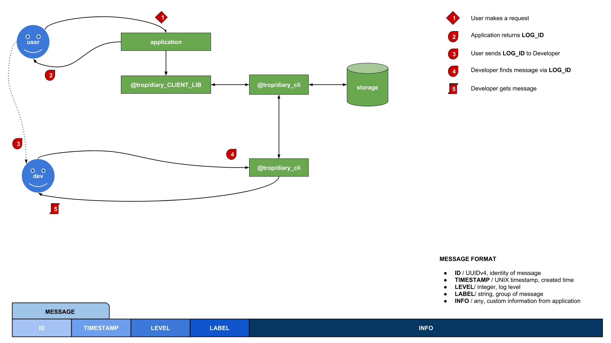

# What the Fuck It is?

* **Q**: Tell me something, please.
* **A**: It is just... a logging tool.
* **Q**: Really?, logging tool, again?, there are many libraries like this, you
  are re-create wheels.
* **A**: So...?
* **Q**: Seriously?, you know, software industry was begin many years ago,
  don't you think they have good enough a logging tool? Why don't you pick
  a old one? You are insane!.
* **A**: Ha ha, bull shit. Don't re-create wheels? So why they make E-Book,
  books is already exist, a long time ago. LOL, why?, to make it better,
  ... or jus for fun,that's all.
* **Q**: Any ways, you should consider a old tool, for save time.
* **A**: OK, up to you, good talking, bye!

# How the hell it works

* **Q**: It is logging tool, we just need to write messages and check
  it somewhere, later?
* **A**: Ha ha, look this guy, he knows it. Yes, it is, let's get more
  details.  Suppose that you have an application and someone do request to
  that application, that request information need to be log, maybe success,
  maybe error or whatever. So application puts a message which contains
  request information to `@trop/diary_api`, `@trop/diary_api` saves it
  and return an `LOG_ID`. In case request is failed, application should show
  up `LOG_ID` to user, then user send `LOG_ID` to developer. With
  `LOG_ID`, developer is able to retrieve all of information about request,
  detect bugs and fix it.
* **Q**: What?
* **A**: Fuck yeah, I know, it is simple but effiency right?
* **Q**: I don't get it, would you like to explain more?
* **A**: Ok, don't worry, let's try this model.

* **Q**: One more time, please
* **A**: God damnit!....

# Jesus, anything else?

* **Q**: That's all?
* **A**: Not really, you are human, you need tools for interacting with
  `@trop/diary_api`. [@trop/diary_cli](https://github.com/kevin-leptons/trop_diary_cli)
  to control APIs via command line, create accounts, retrieve messages...
  [@trop/diary_nodejs](https://github.com/kevin-leptons/trop_diary_nodejs)
  to connect with APIs via programming language.
